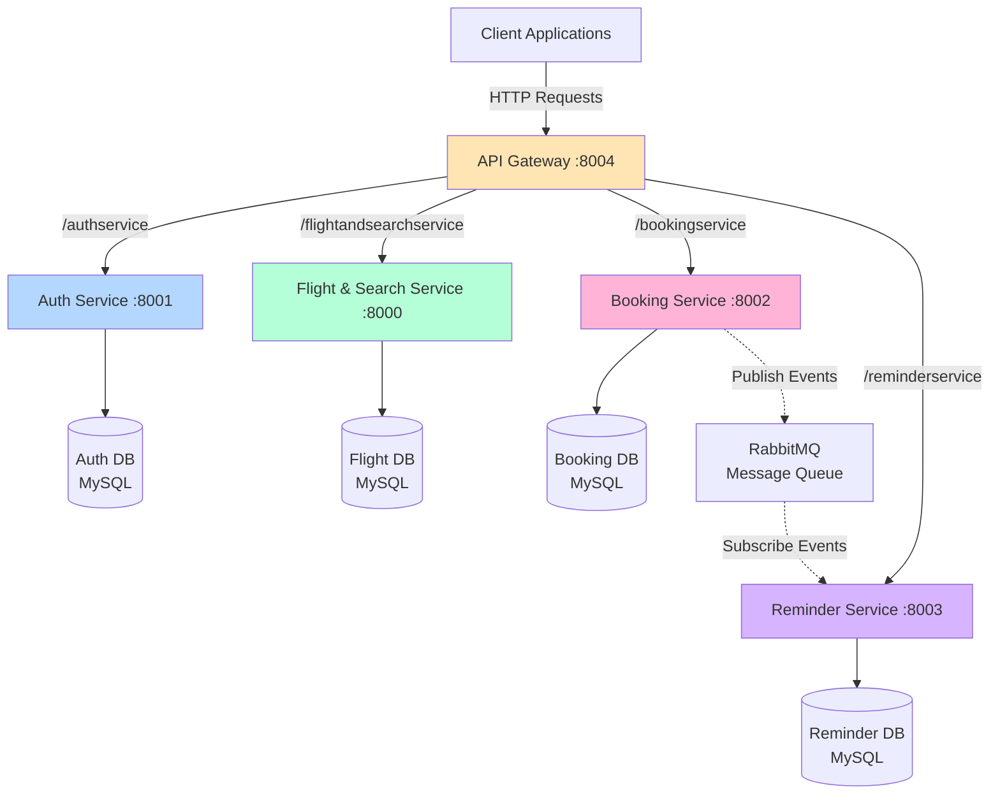
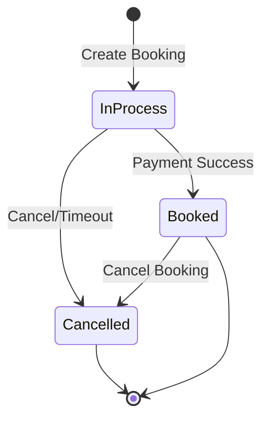
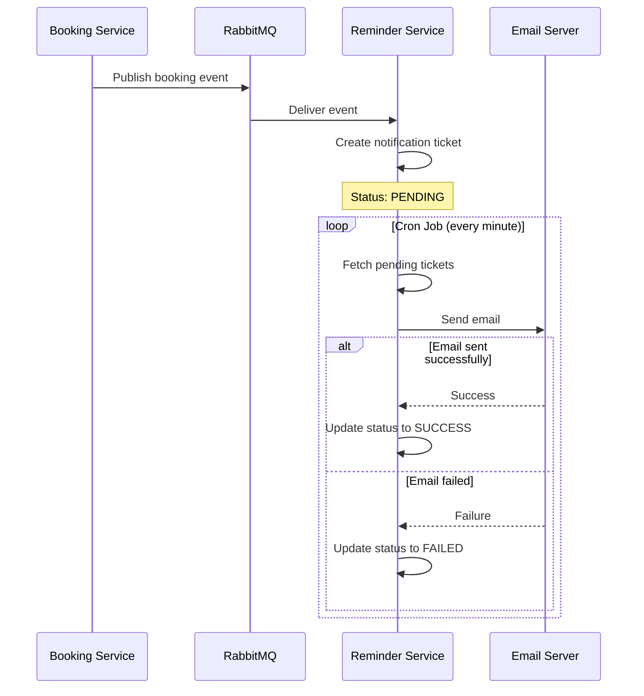
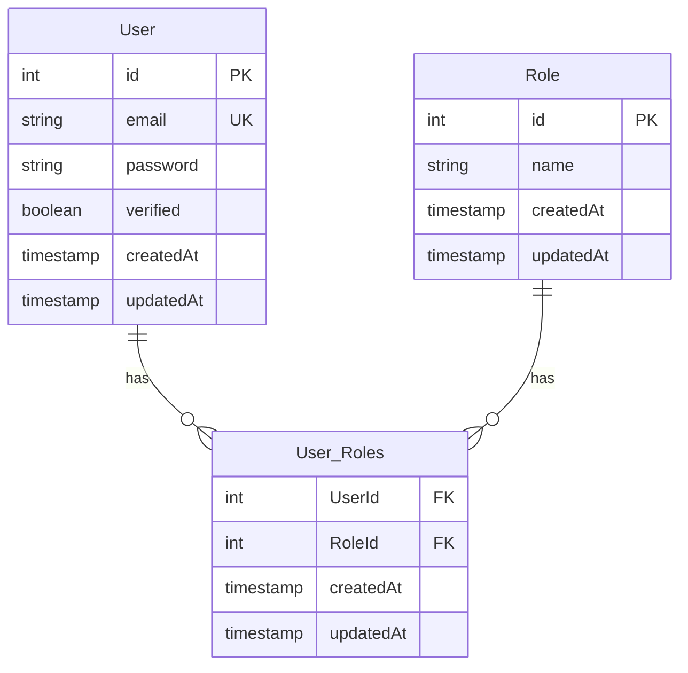
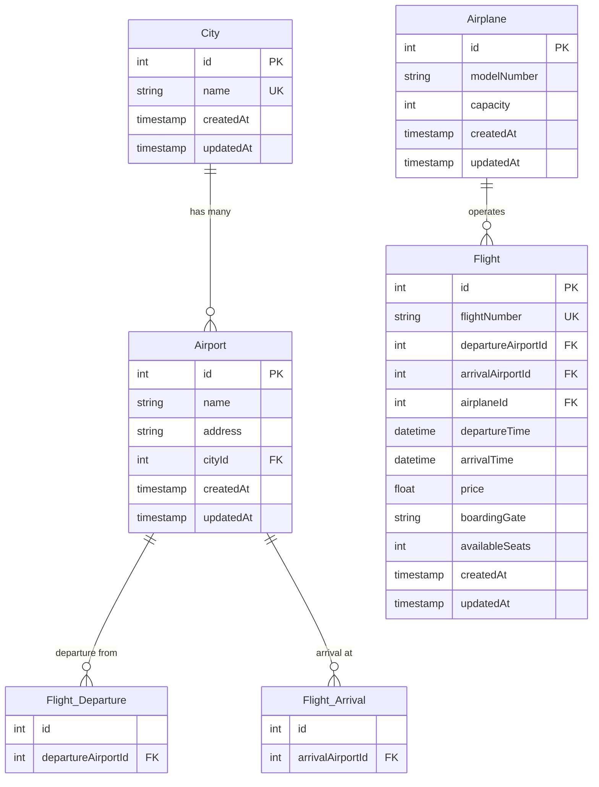
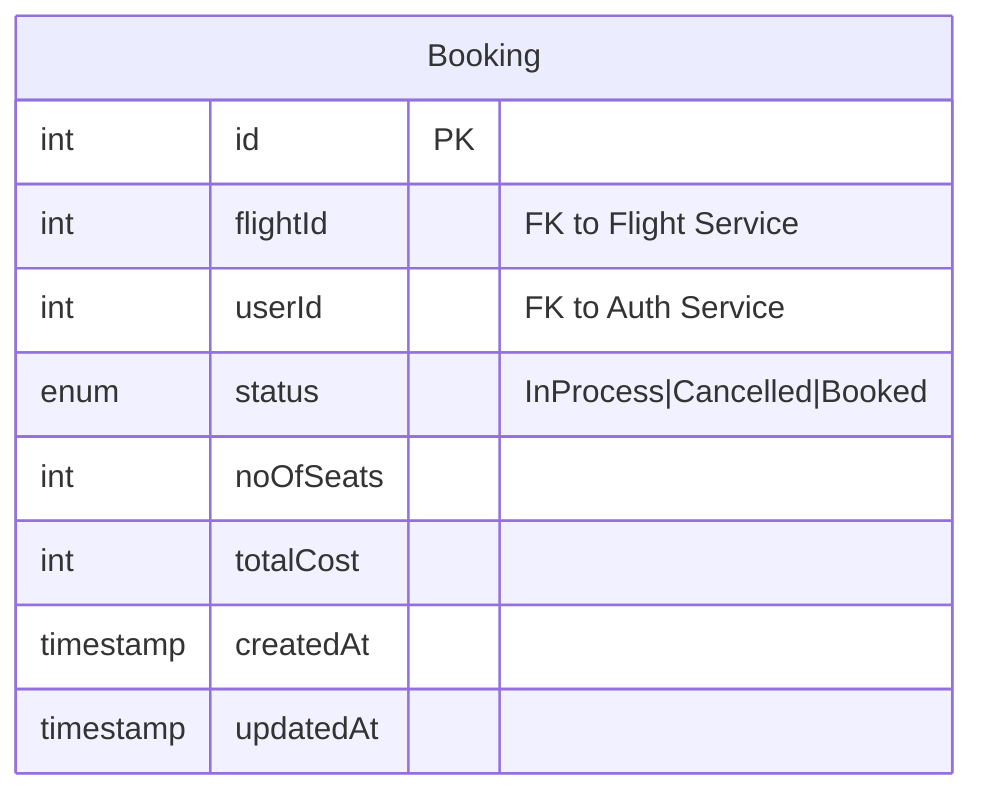
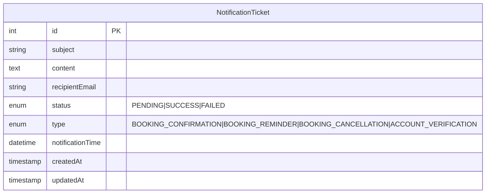
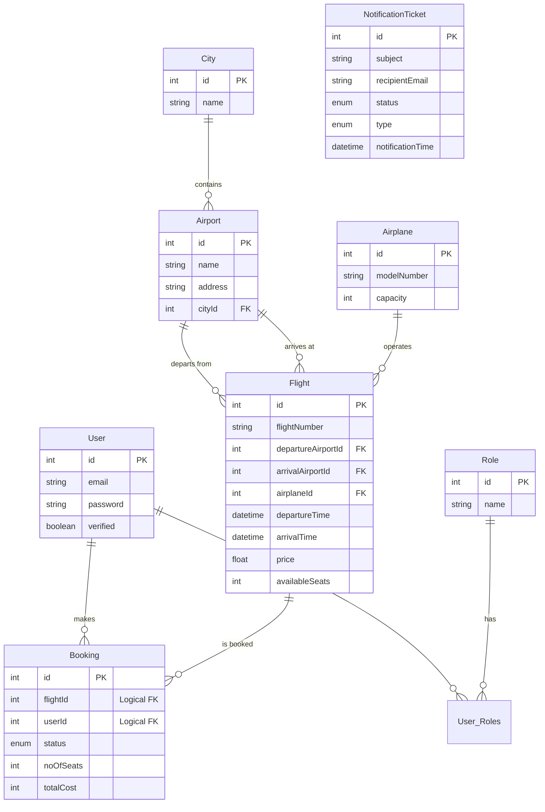
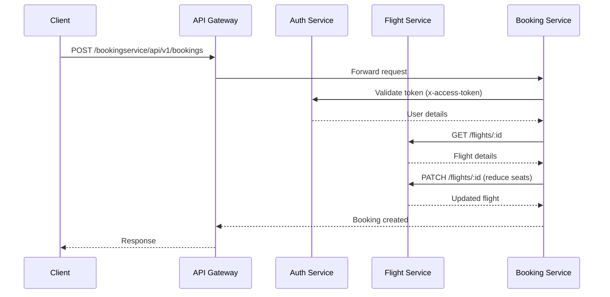
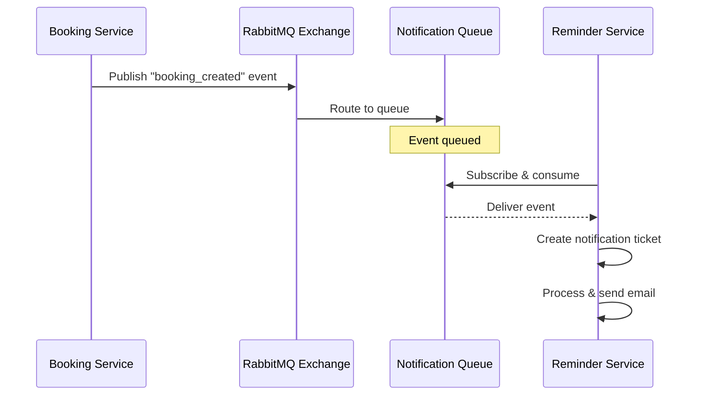

# Airline Microservices Architecture - Complete Documentation

## Table of Contents
1. [Project Overview](#project-overview)
2. [Architecture Diagram](#architecture-diagram)
3. [Service Details](#service-details)
   - [API Gateway](#1-api-gateway)
   - [Auth Service](#2-auth-service)
   - [Flight and Search Service](#3-flight-and-search-service)
   - [Booking Service](#4-booking-service)
   - [Reminder Service](#5-reminder-service)
4. [Entity Relationship Diagrams](#entity-relationship-diagrams)
5. [Inter-Service Communication](#inter-service-communication)
6. [Technology Stack](#technology-stack)

---

## Project Overview

This is a **microservices-based airline booking system** built using Node.js and Express. The system is divided into five independent services that communicate through an API Gateway and use RabbitMQ for asynchronous messaging.

### Key Features
- ✈️ **Flight Search and Management**: Search, create, and manage flights, cities, and airports
- 🔐 **Authentication & Authorization**: JWT-based auth with AWS Cognito integration
- 📅 **Booking Management**: Create, cancel, and manage flight bookings
- 📧 **Email Notifications**: Automated email notifications for bookings and confirmations
- 🚪 **Centralized Gateway**: Single entry point with rate limiting and request proxying
- 📨 **Event-Driven Architecture**: RabbitMQ message queue for asynchronous communication

### System Architecture


---

## Service Details

## 1. API Gateway

### 📍 Port
`8004`

### 🎯 Purpose
Acts as a **reverse proxy** that routes incoming requests to the appropriate microservices. Provides centralized rate limiting, request logging, and security.

### 🔑 Key Features
- **HTTP Proxy Middleware**: Routes requests to backend services based on path
- **Rate Limiting**: 5 requests per minute per IP address
- **IP Logging**: Logs IP addresses for monitoring
- **Compression**: Gzip compression for better performance
- **Security**: Uses Helmet and CORS for security
- **Request Logging**: Morgan for HTTP request logging

### 🛣️ Routes & Proxying

The API Gateway doesn't have its own business logic routes. Instead, it proxies requests to backend services:

| Path Prefix | Target Service | Target URL |
|-------------|---------------|------------|
| `/authservice` | Auth Service | `http://localhost:8001` |
| `/flightandsearchservice` | Flight & Search Service | `http://localhost:8000` |
| `/bookingservice` | Booking Service | `http://localhost:8002` |
| `/reminderservice` | Reminder Service | `http://localhost:8003` |

**Example:**
- Request to `http://localhost:8004/authservice/api/v1/login`
- Gets proxied to → `http://localhost:8001/api/v1/login`

### 📦 Dependencies
- `express` - Web framework
- `http-proxy-middleware` - Proxy middleware
- `express-rate-limit` - Rate limiting
- `morgan` - Logging
- `cors` - CORS handling
- `helmet` - Security headers
- `compression` - Response compression

### 🔒 Rate Limiting Configuration
```javascript
{
  windowMs: 60 * 1000,  // 1 minute
  max: 5,                // 5 requests per window
  message: "Too many requests, please try again after 15 minutes"
}
```

---

## 2. Auth Service

### 📍 Port
`8001`

### 🎯 Purpose
Handles **user authentication and authorization**. Supports both legacy JWT-based authentication and modern AWS Cognito authentication with HTTP-only cookies.

### 🗄️ Database Schema

**Tables:**
- `Users` - User accounts
- `Roles` - User roles (admin, customer, etc.)
- `User_Roles` - Many-to-many relationship table

### 🛣️ API Routes

#### Legacy JWT Authentication
| Method | Route | Description |
|--------|-------|-------------|
| POST | `/api/v1/signup` | Create a new user account |
| GET | `/api/v1/verify-email` | Verify user's email address |
| POST | `/api/v1/login` | Login with email and password |
| GET | `/api/v1/isAuthenticated` | Check if user is authenticated |
| DELETE | `/api/v1/users/:userId` | Delete a user |
| GET | `/api/v1/users` | Get all users |
| GET | `/api/v1/users/:userId` | Get user by ID |
| PUT | `/api/v1/users/:userId` | Update user |
| GET | `/api/v1/verify/isAdmin` | Check if user has admin role |

#### AWS Cognito Authentication
| Method | Route | Description |
|--------|-------|-------------|
| POST | `/api/v1/cognito/signup` | Register with AWS Cognito |
| POST | `/api/v1/cognito/confirm-signup` | Confirm signup with verification code |
| POST | `/api/v1/cognito/login` | Login with Cognito (sets HTTP-only cookies) |
| POST | `/api/v1/cognito/refresh-token` | Refresh access token using refresh token |
| POST | `/api/v1/cognito/logout` | Sign out and clear cookies |
| GET | `/api/v1/cognito/isAuthenticated` | Check authentication status |
| POST | `/api/v1/cognito/forgot-password` | Initiate password reset |
| POST | `/api/v1/cognito/confirm-forgot-password` | Confirm password reset |

### 🔑 Key Features

#### Legacy JWT System
- Email/password authentication
- Bcrypt password hashing
- JWT token generation
- Email verification
- Role-based access control (RBAC)

#### AWS Cognito Integration
- User pool management
- Email verification via Cognito
- HTTP-only signed cookies for tokens
- Automatic token refresh
- Password reset functionality
- Global sign-out capability

#### Security Features
- HTTP-only cookies (XSS protection)
- Signed cookies (tampering prevention)
- Secure flag for HTTPS in production
- SameSite=strict (CSRF protection)
- CORS configuration
- Password policies

### 📦 Key Models

#### User Model
```javascript
{
  email: String (unique, validated),
  password: String (hashed with bcrypt),
  verified: Boolean (default: false),
  createdAt: Date,
  updatedAt: Date
}
```

#### Role Model
```javascript
{
  name: String,
  createdAt: Date,
  updatedAt: Date
}
```

**Relationship:** Users ↔ Roles (Many-to-Many through User_Roles)

### 🔐 Authentication Flow

#### Cognito Login Flow
1. User submits email and password
2. Service authenticates with AWS Cognito
3. Receives access token, refresh token, and ID token
4. Sets tokens in HTTP-only cookies
5. Returns success response with user email in body

#### Token Refresh Flow
1. Client sends request with expired access token
2. Service reads refresh token from cookies
3. Requests new access token from Cognito
4. Updates access token cookie
5. Returns success response

---

## 3. Flight and Search Service

### 📍 Port
`8000`

### 🎯 Purpose
Manages **flights, cities, airports, and airplanes**. Provides flight search functionality with filters.

### 🗄️ Database Schema

**Tables:**
- `Cities` - Cities with airports
- `Airports` - Airport details
- `Airplanes` - Aircraft information
- `Flights` - Flight schedules

### 🛣️ API Routes

#### City Management
| Method | Route | Description |
|--------|-------|-------------|
| POST | `/api/v1/city` | Create a new city |
| POST | `/api/v1/city/bulk-insert` | Create multiple cities |
| DELETE | `/api/v1/city/:id` | Delete a city |
| PATCH | `/api/v1/city/:id` | Update a city |
| GET | `/api/v1/city/:id` | Get a city by ID |
| GET | `/api/v1/city` | Get all cities (with filter by name) |
| GET | `/api/v1/city/:id/airports` | Get all airports in a city |

#### Airport Management
| Method | Route | Description |
|--------|-------|-------------|
| POST | `/api/v1/airports` | Create a new airport |
| POST | `/api/v1/airports/bulk-insert` | Create multiple airports |
| DELETE | `/api/v1/airports/:id` | Delete an airport |
| PATCH | `/api/v1/airports/:id` | Update an airport |
| GET | `/api/v1/airports/:id` | Get an airport by ID |
| GET | `/api/v1/city` | Get all airports (with filters) |

#### Flight Management
| Method | Route | Description |
|--------|-------|-------------|
| POST | `/api/v1/flights` | Create a new flight |
| DELETE | `/api/v1/flights/:id` | Delete a flight |
| PATCH | `/api/v1/flights/:id` | Update a flight |
| GET | `/api/v1/flights/:id` | Get a flight by ID |
| GET | `/api/v1/flights` | Get all flights with filters |

### 🔑 Key Features

#### Flight Search
- Search by departure/arrival airports
- Filter by price range
- Filter by departure/arrival times
- Sort by price, time, etc.
- Pagination support

#### Data Management
- CRUD operations for cities, airports, airplanes, and flights
- Bulk insert capabilities
- Cascade delete for related entities

#### Validation
- Flight creation validation (airports, airplane, times)
- Update validation

### 📦 Key Models

#### City Model
```javascript
{
  name: String (unique),
  createdAt: Date,
  updatedAt: Date
}
```

#### Airport Model
```javascript
{
  name: String,
  address: String,
  cityId: Integer (FK → Cities),
  createdAt: Date,
  updatedAt: Date
}
```

#### Airplane Model
```javascript
{
  modelNumber: String,
  capacity: Integer (default: 200),
  createdAt: Date,
  updatedAt: Date
}
```

#### Flight Model
```javascript
{
  flightNumber: String (unique),
  departureAirportId: Integer (FK → Airports),
  arrivalAirportId: Integer (FK → Airports),
  airplaneId: Integer (FK → Airplanes),
  departureTime: Date,
  arrivalTime: Date,
  price: Float,
  boardingGate: String,
  availableSeats: Integer,
  createdAt: Date,
  updatedAt: Date
}
```

### 🔗 Relationships
- City → Airports (One-to-Many)
- Airport → Flights (One-to-Many) for both departure and arrival
- Airplane → Flights (One-to-Many)

---

## 4. Booking Service

### 📍 Port
`8002`

### 🎯 Purpose
Handles **flight booking operations**. Manages booking lifecycle from creation to cancellation. Communicates with Flight Service for seat availability and Reminder Service for notifications.

### 🗄️ Database Schema

**Table:**
- `Bookings` - Booking records

### 🛣️ API Routes

| Method | Route | Description |
|--------|-------|-------------|
| POST | `/api/v1/bookings` | Create a new booking |
| DELETE | `/api/v1/bookings/:bookingId` | Cancel/delete a booking |
| GET | `/api/v1/bookings/:userId` | Get all bookings for a user |

### 🔑 Key Features

#### Booking Workflow
1. **Create Booking**
   - Validates user authentication (x-access-token header)
   - Checks seat availability with Flight Service
   - Creates booking with "InProcess" status
   - Publishes event to RabbitMQ for notification
   - Updates flight seat availability

2. **Cancel Booking**
   - Updates booking status to "Cancelled"
   - Restores seats to flight
   - Publishes cancellation event

#### Integration Points
- **Flight Service**: GET flight details, PATCH seat availability
- **Reminder Service**: Publishes booking events via RabbitMQ
- **Auth Service**: Validates user authentication tokens

#### Message Queue Integration
- Publishes booking confirmation events
- Publishes booking cancellation events
- Uses RabbitMQ with exchange/routing keys

### 📦 Key Models

#### Booking Model
```javascript
{
  flightId: Integer,
  userId: Integer,
  status: Enum ['InProcess', 'Cancelled', 'Booked'],
  noOfSeats: Integer (default: 1),
  totalCost: Integer (default: 0),
  createdAt: Date,
  updatedAt: Date
}
```

### 🔄 Booking Status Lifecycle


### 📨 Published Events
- `booking_created` - When a new booking is created
- `booking_cancelled` - When a booking is cancelled

---

## 5. Reminder Service

### 📍 Port
`8003`

### 🎯 Purpose
Handles **email notifications** for various events in the system. Subscribes to booking events and sends automated emails.

### 🗄️ Database Schema

**Table:**
- `NotificationTickets` - Email notification queue

### 🛣️ API Routes

| Method | Route | Description |
|--------|-------|-------------|
| POST | `/api/v1/notification` | Create a notification manually |

### 🔑 Key Features

#### Notification Types
- `BOOKING_CONFIRMATION` - Sent when booking is created
- `BOOKING_REMINDER` - Sent before flight departure
- `BOOKING_CANCELLATION` - Sent when booking is cancelled
- `ACCOUNT_VERIFICATION` - Sent for email verification

#### Message Queue Integration
- Subscribes to booking events from RabbitMQ
- Processes events asynchronously
- Creates notification tickets

#### Email Sending
- Uses cron jobs to process pending notifications
- Sends emails via SMTP (likely Nodemailer)
- Updates ticket status (PENDING → SUCCESS/FAILED)

#### Notification Scheduling
- Scheduled notifications for flight reminders
- Immediate notifications for bookings/cancellations
- Retry mechanism for failed emails

### 📦 Key Models

#### NotificationTicket Model
```javascript
{
  subject: String,
  content: Text,
  recipientEmail: String,
  status: Enum ['PENDING', 'SUCCESS', 'FAILED'],
  type: Enum ['BOOKING_CONFIRMATION', 'BOOKING_REMINDER', 
              'BOOKING_CANCELLATION', 'ACCOUNT_VERIFICATION'],
  notificationTime: Date,
  createdAt: Date,
  updatedAt: Date
}
```

### 🔄 Notification Processing Flow


### 📨 Subscribed Events
- Listens to booking exchange with specific routing keys
- Processes booking confirmation events
- Processes booking cancellation events

---

## Entity Relationship Diagrams

### Auth Service ER Diagram



**Relationships:**
- User ↔ Role: Many-to-Many (through User_Roles)

---

### Flight and Search Service ER Diagram



**Relationships:**
- City → Airport: One-to-Many
- Airport → Flight: One-to-Many (departure)
- Airport → Flight: One-to-Many (arrival)
- Airplane → Flight: One-to-Many

**Cascade Rules:**
- Delete City → Cascade delete Airports
- Delete Airport → Cascade delete Flights
- Delete Airplane → Cascade delete Flights

---

### Booking Service ER Diagram



**Note:** This service has foreign key references to external services:
- `flightId` → Flight Service (Flights table)
- `userId` → Auth Service (Users table)

These are **logical foreign keys** only, not enforced at database level due to microservices architecture.

---

### Reminder Service ER Diagram



**Note:** This is a standalone service with no direct database relationships to other services. Integration happens via message queue events.

---

### Complete System ER Diagram



---

## Inter-Service Communication

### Communication Patterns

#### 1. Synchronous Communication (HTTP/REST)
**Used for:** Real-time operations requiring immediate response



**Examples:**
- Booking Service → Auth Service: Token validation
- Booking Service → Flight Service: Get flight details, update seats
- All Services ← API Gateway: Request routing

#### 2. Asynchronous Communication (RabbitMQ)
**Used for:** Non-blocking operations, event notifications



**Message Queue Architecture:**
- **Exchange Type**: Topic Exchange
- **Routing Keys**: Used for message routing
- **Queues**: Dedicated queues per service
- **Durability**: Persistent messages

**Event Flow:**
1. Booking Service publishes event to exchange
2. Exchange routes to appropriate queues based on routing key
3. Reminder Service subscribes to queue
4. Consumes events and processes notifications

---

## Technology Stack

### Backend Technologies
| Technology | Purpose | Used In |
|------------|---------|---------|
| **Node.js** | Runtime environment | All services |
| **Express.js** | Web framework | All services |
| **Sequelize** | ORM for MySQL | All data services |
| **MySQL** | Relational database | All data services |
| **RabbitMQ** | Message queue | Booking, Reminder |
| **JWT** | Token authentication | Auth Service |
| **AWS Cognito** | Identity management | Auth Service |
| **Bcrypt** | Password hashing | Auth Service |
| **Nodemailer** | Email sending | Reminder Service |
| **Node-cron** | Job scheduling | Reminder Service |

### Middleware & Utilities
| Package | Purpose | Used In |
|---------|---------|---------|
| `morgan` | HTTP request logging | All services |
| `helmet` | Security headers | All services |
| `cors` | CORS handling | All services |
| `compression` | Response compression | All services |
| `express-rate-limit` | Rate limiting | API Gateway |
| `http-proxy-middleware` | Reverse proxy | API Gateway |
| `cookie-parser` | Cookie parsing | Auth Service |
| `body-parser` | Request body parsing | All services |

### Development Tools
- **Sequelize CLI**: Database migrations and seeders
- **Nodemon**: Development server
- **PM2**: Production process manager
- **dotenv**: Environment variable management

---

## Service Ports Summary

| Service | Port | Database |
|---------|------|----------|
| API Gateway | 8004 | - |
| Auth Service | 8001 | AUTH_DB_DEV |
| Flight & Search Service | 8000 | Flights_Search_DB_DEV |
| Booking Service | 8002 | BOOKING_DB_DEV |
| Reminder Service | 8003 | REMINDER_DB_DEV |

---

## Key Design Patterns

### 1. **Microservices Architecture**
- Independent services with separate databases
- Loose coupling, high cohesion
- Independent deployment and scaling

### 2. **API Gateway Pattern**
- Single entry point for all clients
- Request routing and aggregation
- Cross-cutting concerns (rate limiting, logging)

### 3. **Event-Driven Architecture**
- Asynchronous communication via message queue
- Event publishing and subscribing
- Loose coupling between services

### 4. **Repository Pattern**
- Data access abstraction
- Separation of business logic and data access
- Used in Booking, Flight, and Auth services

### 5. **Singleton Pattern**
- BookingController uses singleton for channel management
- Ensures single message queue connection

### 6. **Database per Service**
- Each microservice has its own database
- Data independence and autonomy
- Prevents tight coupling

---

## Security Features

### API Gateway Level
- ✅ Rate limiting (5 requests/minute)
- ✅ IP logging for monitoring
- ✅ CORS enabled
- ✅ Helmet for security headers
- ✅ Request compression

### Auth Service Level
- ✅ Bcrypt password hashing (SALT rounds)
- ✅ JWT token-based authentication
- ✅ HTTP-only cookies for Cognito tokens
- ✅ Signed cookies (tampering prevention)
- ✅ Email verification
- ✅ Role-based access control
- ✅ Secure flag in production (HTTPS only)
- ✅ SameSite=strict for CSRF protection

### Service Level
- ✅ Token validation on protected routes
- ✅ Authentication middleware
- ✅ Input validation middleware
- ✅ Error handling middleware

---

## Future Enhancements

### Potential Improvements
1. **API Documentation**: Add Swagger/OpenAPI docs
2. **Caching**: Implement Redis for flight search results
3. **Load Balancing**: Add load balancer for horizontal scaling
4. **Service Discovery**: Implement service registry (Consul, Eureka)
5. **Circuit Breaker**: Add resilience patterns (Hystrix)
6. **Distributed Tracing**: Add OpenTelemetry/Jaeger
7. **Monitoring**: Add Prometheus + Grafana
8. **Centralized Logging**: ELK Stack or Loki
9. **Containerization**: Docker + Kubernetes
10. **Payment Gateway**: Integrate payment processing
11. **WebSocket**: Real-time seat availability updates
12. **GraphQL**: Alternative to REST API

---

## Conclusion

This microservices architecture provides a **scalable, maintainable, and resilient** airline booking system. Each service is independently deployable, has clear responsibilities, and communicates through well-defined interfaces. The use of both synchronous (HTTP) and asynchronous (RabbitMQ) communication patterns ensures optimal performance and reliability.

**Key Strengths:**
- ✈️ Modular and scalable architecture
- 🔐 Robust authentication with modern Cognito integration
- 📨 Event-driven notifications
- 🚪 Centralized API gateway
- 🗄️ Clean database design with proper relationships
- 🔒 Security-first approach

**GitHub Repositories:**
- [Airline-API-Gateway](https://github.com/Rishabh-Kumar01/Airline-API-Gateway)
- [Auth-Service](https://github.com/Rishabh-Kumar01/Auth-Service)
- [FlightsAndSearchService](https://github.com/Rishabh-Kumar01/FlightsAndSerachService)
- [BookingService](https://github.com/Rishabh-Kumar01/BookingService)
- [Reminder-Service](https://github.com/Rishabh-Kumar01/Reminder-Service)
